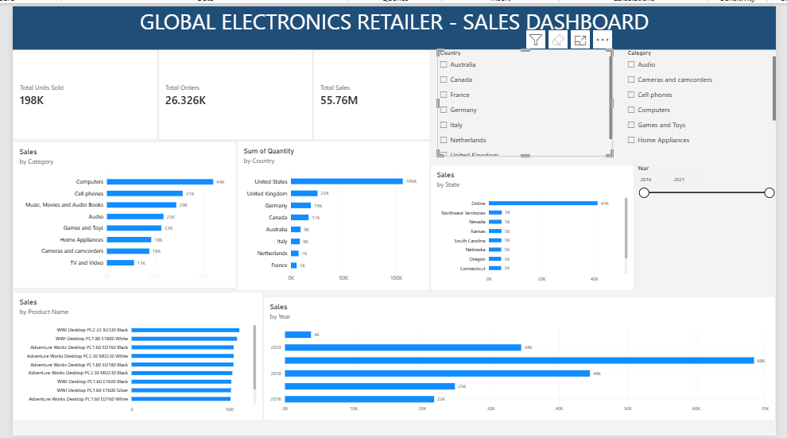

# Global Electronics Retailer — Sales Analysis

## Project Overview

This project analyses sales data from a global electronics retailer to identify sales trends, product performance, customer markets, and store performance.

The project demonstrates my data analytics skills using **Excel, SQL, and Power BI**.

## Tools Used

* Microsoft Excel — Data cleaning and validation
* MySQL — Data analysis and SQL queries
* Power BI — Data visualisation and interactive dashboard
* GitHub — Project documentation and portfolio

## Dataset

The dataset contains information about:

* Sales transactions
* Products
* Customers
* Stores
* Exchange rates

The Sales table contains **62,885 transaction records**.

## Data Cleaning

The data was checked for:

* Missing values
* Duplicate records
* Incorrect or unusual values
* Relationships between tables

Missing delivery dates in the Sales table were retained because they represent unavailable delivery information rather than invalid transactions.

## SQL Analysis

SQL was used to calculate and investigate:

* Total orders
* Total units sold
* Sales by year
* Sales by category
* Sales by customer country
* Top-performing products
* Top-performing stores
* Monthly sales trends
* Average order value

## Power BI Dashboard
## Dashboard Preview

The interactive dashboard contains:

* Total Sales
* Total Orders
* Total Units Sold
* Sales by Category
* Sales by Country
* Top 10 States by Units Sold
* Sales by Year and Month
* Top 10 Products

The dashboard also includes interactive filters for:

* Year
* Country
* Category

## Key Findings

* Computers generated the highest sales value among the product categories.
* The United States generated the highest sales value among customer countries.
* 2019 was the strongest full year in the dataset.
* February and December were among the strongest sales months.
* The dataset contains 26,326 unique orders and 197,757 units sold.

## Project Workflow

**Excel → Data Cleaning → SQL Analysis → Power BI Dashboard → GitHub Portfolio**

## Author

Baah Joseph Ayertey

Aspiring Data Analyst
